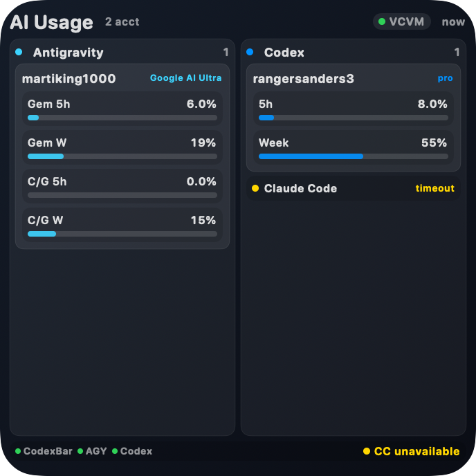
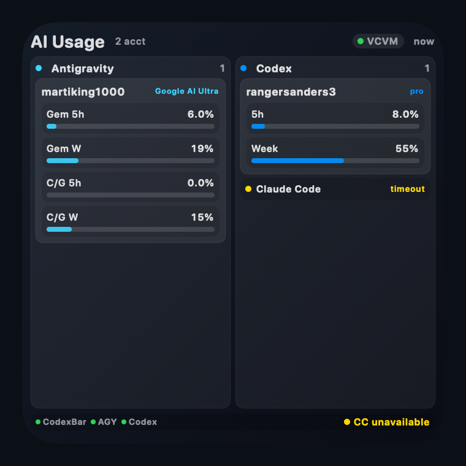
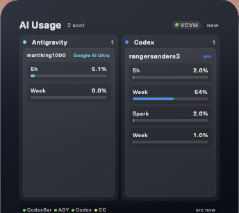
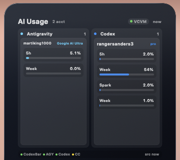

# AI Usage Native Widget Proof

Public proof screenshots for the macOS AI Usage Native Widget.

## Quality Pass 2026-06-22

Fresh proof after the compact layout pass:

- Codex shows the main 5h and weekly limits only; Spark weekly is hidden.
- Antigravity shows both current limit pairs from CodexBar data: Gemini 5h/week and Claude/GPT 5h/week.
- Claude Code is visible as unavailable/timeout instead of disappearing.
- Screenshot is widget-only with tight padding.

## Widget Only

## Widget Only With CC

## Widget With Margin

## Widget With Margin And CC

